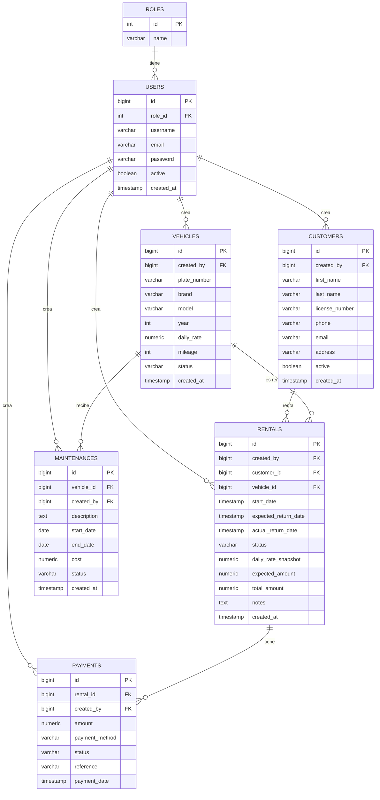

# Vehicle Rental Management API

API REST para la gestión de un negocio de renta de vehículos, construida con **Java 21** y **Spring Boot**. Incluye autenticación con JWT, control de roles, lógica de negocio para rentas/pagos/mantenimientos, y documentación interactiva con Swagger/OpenAPI.

Proyecto desarrollado como ejercicio de arquitectura backend, con énfasis en separación de responsabilidades, consistencia de estados entre módulos y trazabilidad de operaciones.

---

## Tabla de contenidos

- [Stack tecnológico](#stack-tecnológico)
- [Módulos y funcionalidades](#módulos-y-funcionalidades)
- [Modelo de base de datos](#modelo-de-base-de-datos)
- [Arquitectura](#arquitectura)
- [Cómo ejecutar el proyecto](#cómo-ejecutar-el-proyecto)
    - [Opción 1: Docker (recomendado)](#opción-1-docker-recomendado)
    - [Opción 2: Local (IDE + PostgreSQL propio)](#opción-2-local-ide--postgresql-propio)
- [Variables de entorno](#variables-de-entorno)
- [Documentación de la API (Swagger)](#documentación-de-la-api-swagger)
- [Usuario administrador inicial](#usuario-administrador-inicial)
- [Roles y permisos](#roles-y-permisos)

---

## Stack tecnológico

- **Java 21**
- **Spring Boot 4** (Web, Data JPA, Security, Validation)
- **PostgreSQL**
- **JWT** (autenticación stateless, vía `jjwt`)
- **Lombok**
- **springdoc-openapi** (Swagger UI)
- **Docker / Docker Compose**
- **Maven**

---

## Módulos y funcionalidades

| Módulo | Descripción |
|---|---|
| **Auth** | Registro de empleados (público), registro de administradores (solo ADMIN), login con JWT |
| **User / Role** | Gestión de usuarios y roles (`ADMIN`, `EMPLOYEE`) |
| **Customer** | CRUD de clientes, borrado lógico (`active`), reactivación automática si se reintenta registrar una licencia ya existente |
| **Vehicle** | CRUD de vehículos, estados `AVAILABLE` / `RENTED` / `MAINTENANCE` / `INACTIVE` |
| **Rental** | Creación de rentas con cálculo automático de monto esperado, devolución de vehículo, cancelación, consulta por estado |
| **Payment** | Registro de pagos, confirmación, cancelación, consulta por renta/estado/método. Recalcula el total pagado de la renta al confirmarse |
| **Maintenance** | Registro de mantenimientos, finalización, cancelación, consulta por estado |

Todos los módulos (excepto `Auth`/registro público) requieren autenticación JWT y los roles `ADMIN` o `EMPLOYEE`.

---

## Modelo de base de datos



> Todas las entidades registran `created_by` (referencia al `User` que realizó la operación), lo que da trazabilidad completa de quién creó cada registro.

---

## Arquitectura

El proyecto sigue una **arquitectura monolítica modular**, organizada por dominio bajo el paquete `com.gregory.vehicleRentalAPI`:

```
auth/         → registro, login, JWT, inicialización de datos
user/         → entidad y repositorio de usuarios
role/         → entidad y repositorio de roles
customer/     → gestión de clientes
vehicle/      → gestión de vehículos
rental/       → gestión de rentas
payment/      → gestión de pagos
maintenance/  → gestión de mantenimientos
security/     → configuración de Spring Security, filtros JWT
shared/       → ApiResponse, excepciones, eventos de aplicación
```

Cada módulo sigue la misma estructura interna: `Controller` → `Service` → `Repository`, con `DTOs` propios para entrada/salida y excepciones de negocio personalizadas.

Para el razonamiento detallado detrás de las decisiones de diseño (snapshots de tarifa, eventos de dominio, validaciones de consistencia entre módulos, etc.), ver [`ARCHITECTURE.md`](./ARCHITECTURE.md).

---

## Cómo ejecutar el proyecto

### Opción 1: Docker (recomendado)

Requiere tener [Docker Desktop](https://www.docker.com/products/docker-desktop/) instalado y corriendo.

1. Clona el repositorio
2. En la raíz del proyecto, ejecuta:

```bash
docker-compose --env-file .env.docker up --build
```

> ⚠️ Es necesario el flag `--env-file .env.docker` — el archivo `.env.docker` incluido en el repositorio contiene valores de demostración (no son credenciales reales de producción) necesarios para levantar la aplicación y la base de datos correctamente.

3. Una vez que los contenedores estén arriba, la API estará disponible en `http://localhost:8080`
4. La documentación interactiva estará en `http://localhost:8080/swagger-ui/index.html`

Este comando levanta dos contenedores:
- `db`: PostgreSQL 16
- `app`: la API, construida desde el `Dockerfile` (multi-stage build)

Al iniciar, la aplicación crea automáticamente los roles `ADMIN`/`EMPLOYEE` y un usuario administrador por defecto (ver [Usuario administrador inicial](#usuario-administrador-inicial)).

---

### Opción 2: Local (IDE + PostgreSQL propio)

Requiere Java 21, Maven y una instancia de PostgreSQL corriendo localmente.

1. Crea una base de datos PostgreSQL (por ejemplo, `vehicle_rental`)
2. Crea un archivo `.env` en la raíz del proyecto (puedes usar `.env.example` como plantilla) con tus credenciales reales:

```
DB_URL=jdbc:postgresql://localhost:5432/vehicle_rental
DB_USERNAME=tu_usuario
DB_PASSWORD=tu_password

JWT_SECRET=una_clave_secreta_larga_y_unica

ADMIN_USERNAME=admin
ADMIN_EMAIL=admin@tudominio.com
ADMIN_PASSWORD=una_password_segura
```

3. Si usas IntelliJ IDEA, instala el plugin **EnvFile** y habilítalo en la configuración de ejecución, apuntando a tu archivo `.env`
4. Ejecuta la clase principal `SpringBootVehicleRentalAPI`

> El archivo `.env` está incluido en `.gitignore` — **nunca** subas tus credenciales reales al repositorio.

---

## Variables de entorno

| Variable | Descripción |
|---|---|
| `DB_URL` | URL de conexión JDBC a PostgreSQL |
| `DB_USERNAME` | Usuario de la base de datos |
| `DB_PASSWORD` | Contraseña de la base de datos |
| `JWT_SECRET` | Clave usada para firmar y validar los tokens JWT |
| `ADMIN_USERNAME` | Username del administrador inicial |
| `ADMIN_EMAIL` | Email del administrador inicial (usado para login) |
| `ADMIN_PASSWORD` | Password del administrador inicial |

---

## Documentación de la API (Swagger)

Con el proyecto corriendo (Docker o local), la documentación interactiva está disponible en:

```
http://localhost:8080/swagger-ui/index.html
```

Desde ahí puedes:
- Ver todos los endpoints agrupados por módulo, con descripciones de las reglas de negocio aplicadas
- Autenticarte con un token JWT mediante el botón **Authorize** (esquema `bearerAuth`)
- Probar los endpoints directamente desde el navegador

---

## Usuario administrador inicial

Al arrancar por primera vez, la aplicación verifica que existan los roles `ADMIN`/`EMPLOYEE` y al menos un usuario `ADMIN`. Si no existen, los crea automáticamente usando los valores de `ADMIN_USERNAME` / `ADMIN_EMAIL` / `ADMIN_PASSWORD`.

Para iniciar sesión con este usuario:

```http
POST /auth/login
Content-Type: application/json

{
  "email": "<ADMIN_EMAIL>",
  "password": "<ADMIN_PASSWORD>"
}
```

La respuesta incluye un token JWT que debe usarse como `Authorization: Bearer <token>` en el resto de los endpoints.

---

## Roles y permisos

| Rol | Permisos |
|---|---|
| `EMPLOYEE` | Acceso completo a las operaciones del día a día (clientes, vehículos, rentas, pagos, mantenimientos). Toda operación queda asociada al usuario que la realizó (`created_by`), lo que permite auditoría sin restringir el flujo operativo |
| `ADMIN` | Todo lo anterior, además de poder registrar nuevos administradores (`POST /auth/admin/register`) |

El registro de empleados (`POST /auth/register`) es público — cualquiera puede crear una cuenta `EMPLOYEE`. El registro de administradores requiere estar autenticado como `ADMIN`.
